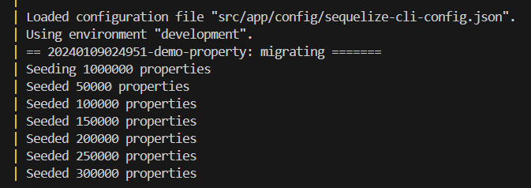
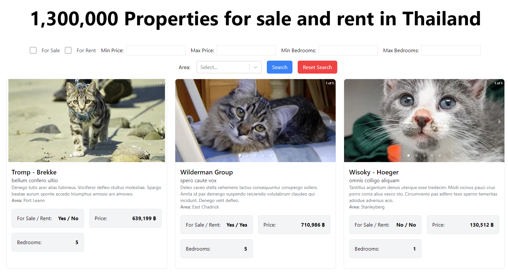

# Estate Property Search Boilerplate

This is a boilerplate for building a property search application using Next.js and Sequelize for Object-relational mapping (ORM). It provides a solid starting point for professionals to build their real estate applications.

## Table of Contents

1. [Prerequisites](#prerequisites)
2. [Getting Started](#getting-started)
3. [Accessing the Server](#accessing-the-server)

## Prerequisites

Before you begin, ensure you have met the following requirements:

- You have installed the latest version of [Docker](https://www.docker.com/get-started).
- You have a Windows/Linux/Mac machine with a recent version of [Node.js](https://nodejs.org/en/download/) and npm installed.

## Getting Started

To start the application, follow these steps:

1. Clone this repository.
2. Navigate to the project directory.
3. Run the following command to start the Docker container:

```bash
docker-compose up --build
```

This command will start all the services defined in docker-compose.yml.

Please be patient while the database is being seeded. This process can take some time, especially if there are a large number of seeders ( 1,000,000 by default). The image below illustrates the seeding process.



Refer to the custom seeder at [Property seeder](https://github.com/pitchayakit/next-js-boilerplate/blob/master/src/app/database/seeders/20240109024951-demo-property.js).

## Accessing the Server

Once the server is up and running, you can access it at:
```
http://localhost:3000
```

